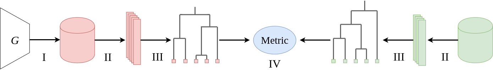
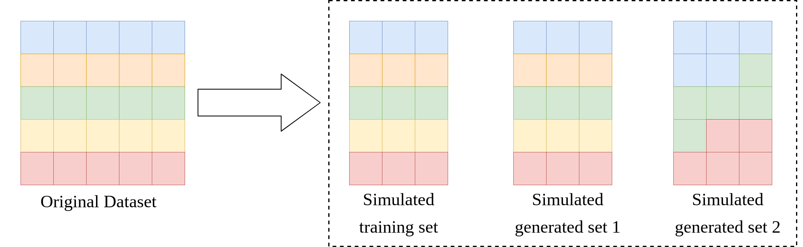

# Undergraduate thesis: Dendrogram Distance

This repository contains code for the experiments performed in my undergraduate thesis entitled "Métrica de avaliação para modelos geradores utilizando agrupamento hierárquico" ("Evaluation metric for generative models using hierarchical clustering", in English). This work was presented on June 2020 at Universidade de São Paulo.

## The metric

Our proposed metric, called Dendrogram Distance, uses hierarchical clustering to quantify how good a generator is. The main point of our method is to compute the divergence between a dendrogram built from samples from the training data and another dendrogram built with samples from the generator. As other metrics, such as FID and IS, we use a Inception-V3 as a feature extractor for the images. The following diagram ilustrates how our metric works:

<p align="center">
    
</p>

## Simulating mode collapse

In order to check if our is capable of detecting generators that suffer from mode collapse we propose using a evaluation task based on sampling from real datasets. This works by sampling a subset of a dataset to represent the "training data" of the model and a several subsets to represent samples generated by a generator. Using this approach we are able to simulate generator that present mode collapse and verify if our metric is capable of detecting them.

<p align="center">
    
</p>


## Running experiments

```bash
python run_experiment.py exp_setup.yaml output_dir
```

The code is organized in order to automate experiments. To run a experiment the user must provide a `.yaml` that specifies the information for the experiments, with includes some metadata and the distribution of classes in each created subset. A model for such file can be found at `sample_setup.yaml`.